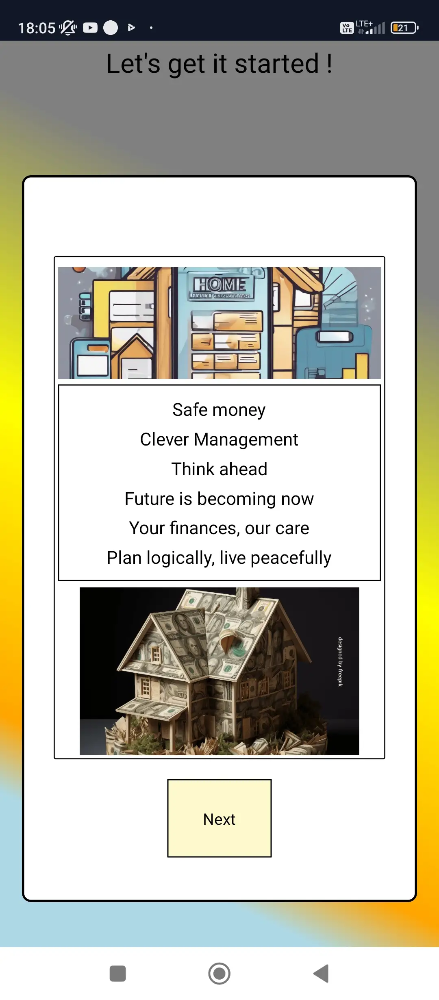
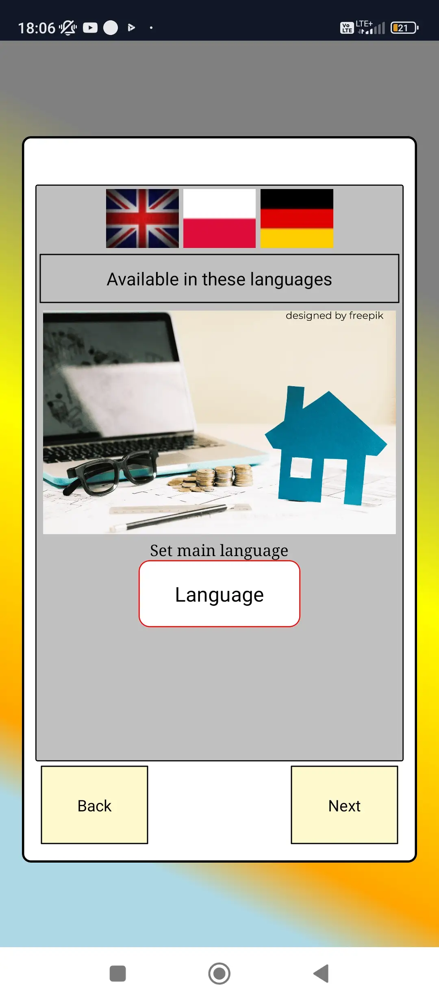
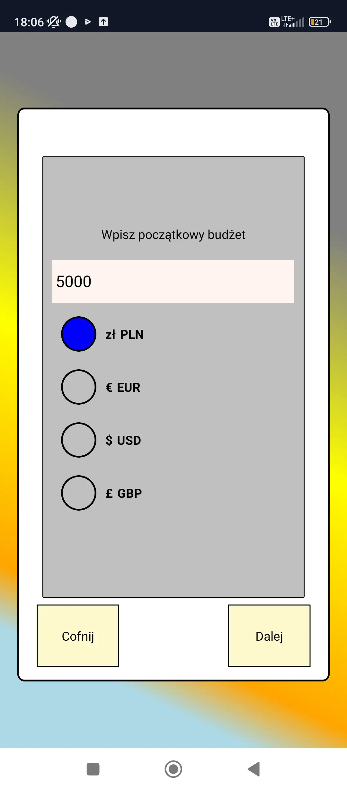
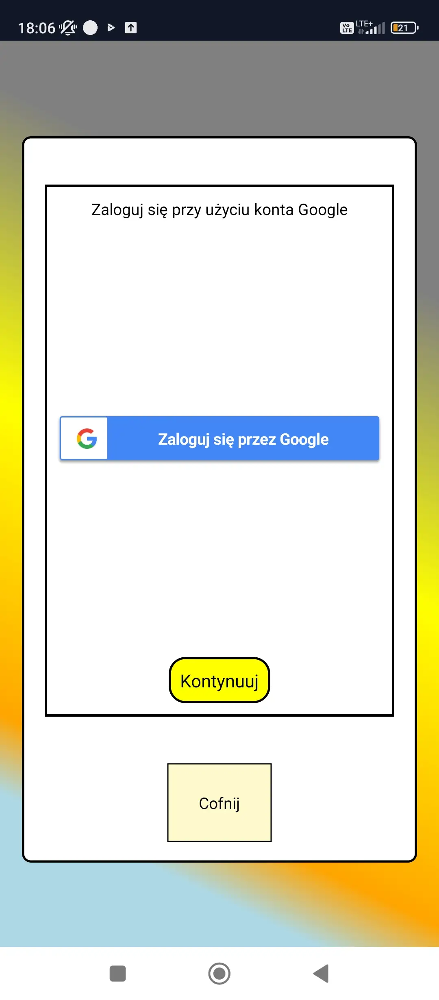

# Apperance of mobile app

<p align="center">
     
     
     
     
</p>

## Konfiguracja projektu

Z package.json trzeba doinstalować wszystkie potrzebne biblioteki i pakiety (metadane) z których ten projekt korzysta. Stworzy się folder node_modules.

```bash
# using npm
npm install

```

W `android/app/src/build.gradle` trzeba zmienić w

```bash
buildTypes {
        debug {
            signingConfig signingConfigs.debug
        }
        release {
            // Caution! In production, you need to generate your own keystore file.
            // see https://reactnative.dev/docs/signed-apk-android.
            shrinkResources true
            signingConfig signingConfigs.release
            //signingConfig signingConfigs.debug
            minifyEnabled enableProguardInReleaseBuilds
            proguardFiles getDefaultProguardFile("proguard-android.txt"), "proguard-rules.pro"
        }
}

```

z signingConfig signingConfigs.release na signingConfig signingConfigs.debug. Wystarczy zakomentować to pierwsze. Czyli jeśli debugujemy i uruchamiamy na emulatorze bądź fizycznym telefonie musi być to ustawione.

Nie kompilować na iOs , nie znam efektu działania aplikacji , czy w ogóle się uruchomi czy wyrzuci błąd. Aplikacje można przetestować tylko w trybie debugowania , gdyż jest domyślny debug.keystore. Jeśli chce się format .apk konieczne jest wygenerowanie nowego własnego keystore, który będzie zawierać klucz sha-1 , ale ten klucz ja wpisuje w cloud firestore w Uwierzytelnianiu dodając nowy fingerprint, wtedy logowanie działa. W trybie debugowania powinno działać logowanie. Wersja Androida 12 i niżej działa nie wiem jak nowsze wersje Androida.

W innych plikach konfiguracyjnych w katalogu android , wszystko jest wpisane/skonfigurowane więc raczej nie ma konieczności dodawania czegoś jeszcze. Po zrobieniu `git pull origin main` powinno wszystko zaciągnąć.

## Step 1: Start the Metro Server

First, you will need to start **Metro**, the JavaScript _bundler_ that ships _with_ React Native.

To start Metro, run the following command from the _root_ of your React Native project:

```bash
# using npm
npm start

# OR using Yarn
yarn start
```

## Step 2: Start your Application

Let Metro Bundler run in its _own_ terminal. Open a _new_ terminal from the _root_ of your React Native project. Run the following command to start your _Android_ or _iOS_ app:

### For Android

```bash
# using npm
npm run android

# OR using Yarn
yarn android
```

If everything is set up _correctly_, you should see your new app running in your _Android Emulator_ or _iOS Simulator_ shortly provided you have set up your emulator/simulator correctly.

This is one way to run your app — you can also run it directly from within Android Studio and Xcode respectively.

## Step 3: Modifying your App

Now that you have successfully run the app, let's modify it.

1. Open `App.tsx` in your text editor of choice and edit some lines.
2. For **Android**: Press the <kbd>R</kbd> key twice or select **"Reload"** from the **Developer Menu** (<kbd>Ctrl</kbd> + <kbd>M</kbd> (on Window and Linux) or <kbd>Cmd ⌘</kbd> + <kbd>M</kbd> (on macOS)) to see your changes!

   For **iOS**: Hit <kbd>Cmd ⌘</kbd> + <kbd>R</kbd> in your iOS Simulator to reload the app and see your changes!

## Congratulations! :tada:

You've successfully run and modified your React Native App. :partying_face:

### Now what?

- If you want to add this new React Native code to an existing application, check out the [Integration guide](https://reactnative.dev/docs/integration-with-existing-apps).
- If you're curious to learn more about React Native, check out the [Introduction to React Native](https://reactnative.dev/docs/getting-started).

# Troubleshooting

If you can't get this to work, see the [Troubleshooting](https://reactnative.dev/docs/troubleshooting) page.

# Learn More

To learn more about React Native, take a look at the following resources:

- [React Native Website](https://reactnative.dev) - learn more about React Native.
- [Getting Started](https://reactnative.dev/docs/environment-setup) - an **overview** of React Native and how setup your environment.
- [Learn the Basics](https://reactnative.dev/docs/getting-started) - a **guided tour** of the React Native **basics**.
- [Blog](https://reactnative.dev/blog) - read the latest official React Native **Blog** posts.
- [`@facebook/react-native`](https://github.com/facebook/react-native) - the Open Source; GitHub **repository** for React Native.
